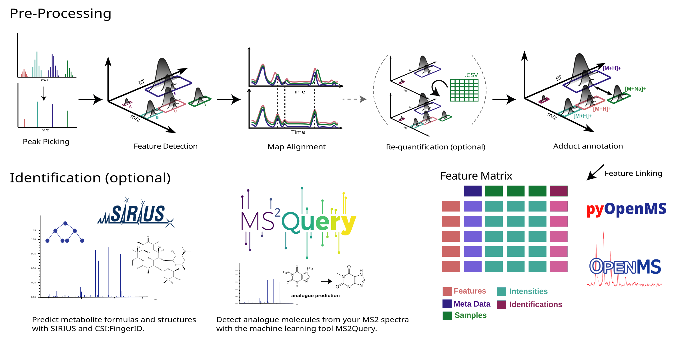
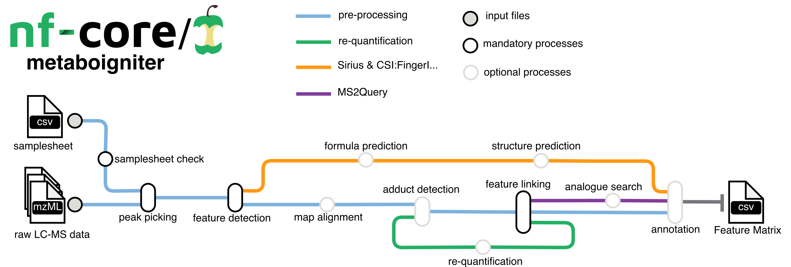

#  

[](https://nf-co.re/metaboigniter/results)[](https://doi.org/10.5281/zenodo.4743790)

[](https://www.nextflow.io/)
[](https://docs.conda.io/en/latest/)
[](https://www.docker.com/)
[](https://sylabs.io/docs/)
[](https://tower.nf/launch?pipeline=https://github.com/nf-core/metaboigniter)

[](https://nfcore.slack.com/channels/metaboigniter)[](https://twitter.com/nf_core)[](https://mstdn.science/@nf_core)[](https://www.youtube.com/c/nf-core)

## Introduction

**nf-core/metaboigniter** is a bioinformatics pipeline that ingests raw mass spectrometry data in mzML format, typically in the form of peak lists and MS2 spectral data, for comprehensive metabolomics analysis. The key stages involve centroiding, feature detection, adduct detection, alignment, and linking, which progressively refine and align the data. The pipeline can also perform requantification to compensate for missing values and leverages MS2Query for compound identification based on MS2 data, outputting a comprehensive list of detected and potentially identified metabolites.



1. Centroiding: Converts the continuous mass spectra into a series of discrete points.
2. Feature Detection: Identifies unique signals or 'features' in the spectra.
3. Adduct Detection: Identifies adduct ions, which are formed by the interaction of the sample with the ion source.
4. Alignment: Ensures that the same features across different samples are matched together.
5. Linking: Establishes connections between features across different ionization modes or adducts.
6. Requantification: Fills in missing values in the data set for a more complete analysis.
7. Identification: Uses MS2Query and SIRIUS to identify compounds based on their MS2 spectral data.
8. Output Generation: Produces a comprehensive list of detected and potentially identified metabolites.



## Usage

> [!NOTE]
> If you are new to Nextflow and nf-core, please refer to [this page](https://nf-co.re/docs/usage/installation) on how to set-up Nextflow. Make sure to [test your setup](https://nf-co.re/docs/usage/introduction#how-to-run-a-pipeline) with `-profile test` before running the workflow on actual data.

First, prepare a samplesheet with your input data that looks as follows:

`samplesheet.csv`:

```csv
sample,level,type,msfile
CONTROL_REP1,MS1,normal,mzML_POS_Quant/X2_Rep1.mzML
CONTROL_REP2,MS1,normal,mzML_POS_Quant/X2_Rep2.mzML
POOL_MS2,MS2,normal,mzML_POS_ID/POOL_MS2.mzML
```

Each row in this CSV file represents a unique sample, with the details provided in the columns.

1. sample: This column should contain unique names for each sample. No two samples should share the same name in this column.
2. level: This column should specify the level of mass spectrometry data contained in each sample file. This can be 'MS1' for files containing only MS1 data, 'MS2' for files containing only MS2 data, and 'MS12' for files containing both MS1 and MS2 data.
3. type: This column can contain any descriptor of your choice, such as 'normal', 'disease', etc. This is usually used to provide some classification or group identification to your samples.
4. msfile: This column should contain the path to the mzML file for each sample.

Now, you can run the pipeline using:

```bash
nextflow run nf-core/metaboigniter \
   -profile <docker/singularity/.../institute> \
   --input samplesheet.csv \
   --outdir <OUTDIR>
```

> [!WARNING]
> Please provide pipeline parameters via the CLI or Nextflow `-params-file` option. Custom config files including those provided by the `-c` Nextflow option can be used to provide any configuration _**except for parameters**_;
> see [docs](https://nf-co.re/usage/configuration#custom-configuration-files).

For more details and further functionality, please refer to the [usage documentation](https://nf-co.re/metaboigniter/usage) and the [parameter documentation](https://nf-co.re/metaboigniter/parameters).

## Pipeline output

To see the results of an example test run with a full size dataset refer to the [results](https://nf-co.re/metaboigniter/results) tab on the nf-core website pipeline page.
For more details about the output files and reports, please refer to the
[output documentation](https://nf-co.re/metaboigniter/output).

## Credits

nf-core/metaboigniter was originally written by Payam Emami. The DSL2 version was developed with significant contributions from Axel Walter and Efi Kontou.

## Contributions and Support

If you would like to contribute to this pipeline, please see the [contributing guidelines](.github/CONTRIBUTING.md).

For further information or help, don't hesitate to get in touch on the [Slack `#metaboigniter` channel](https://nfcore.slack.com/channels/metaboigniter) (you can join with [this invite](https://nf-co.re/join/slack)).

## Citations

If you use nf-core/metaboigniter for your analysis, please cite it using the following doi: [10.5281/zenodo.4743790](https://doi.org/10.5281/zenodo.4743790)

An extensive list of references for the tools used by the pipeline can be found in the [`CITATIONS.md`](CITATIONS.md) file.

You can cite the `nf-core` publication as follows:

> **The nf-core framework for community-curated bioinformatics pipelines.**
>
> Philip Ewels, Alexander Peltzer, Sven Fillinger, Harshil Patel, Johannes Alneberg, Andreas Wilm, Maxime Ulysse Garcia, Paolo Di Tommaso & Sven Nahnsen.
>
> _Nat Biotechnol._ 2020 Feb 13. doi: [10.1038/s41587-020-0439-x](https://dx.doi.org/10.1038/s41587-020-0439-x).
