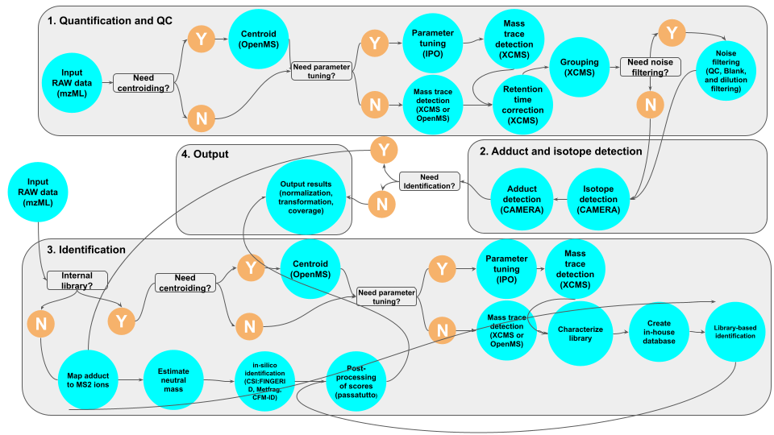

# 

**Pre-processing of mass spectrometry-based metabolomics data with quantification and identification based on MS1 and MS2 data**.

[](https://github.com/nf-core/metaboigniter/actions)
[](https://github.com/nf-core/metaboigniter/actions)
[](https://www.nextflow.io/)

[](https://bioconda.github.io/)
[](https://hub.docker.com/r/nfcore/metaboigniter)
[](https://nfcore.slack.com/channels/metaboigniter)
[](https://doi.org/10.5281/zenodo.4743790)

## Introduction

**nf-core/metaboigniter** is bioinformatics pipeline for pre-processing of mass spectrometry-based metabolomics data.

The workflow performs MS1 based quantification and MS2 based identification using combination of different modules. The following steps can be performed using the workflow:



- Centroiding (optional): Also referred to as peak pickering is a step that reduce the distribution of ions derived from a single mass to the peak of the distribution.
- parameter tuning using IPO: MS1 quantification and library characterization parameters can be tuned using IPO
- mass trace detection: The ions derived from the same analytes are clustered together forming a mass trace. These are the entities that will be used for quantification.
- mass trace matching and retention time (RT) correction: The mass traces across different samples will be match against each other and  RT shift between the samples will be adjusted.
- filtering (optional): The mass traces will be filtered out based on the QC samples.
- Annotation: The isotopes and adducts will be annotated in this step.
- MS2 (identification): At the moment we support two types of identification: in-silico and identificaiton based on internal library. This will be expanded in the corresponding section. At the moment we do not support MS1-based identification.

The pipeline is built using [Nextflow](https://www.nextflow.io), a workflow tool to run tasks across multiple compute infrastructures in a very portable manner. It comes with docker containers making installation trivial and results highly reproducible.

## Quick Start

1. Install [`nextflow`](https://nf-co.re/usage/installation) (`>=20.04.0`)

2. Install any of [`Docker`](https://docs.docker.com/engine/installation/), [`Singularity`](https://www.sylabs.io/guides/3.0/user-guide/), [`Podman`](https://podman.io/), [`Shifter`](https://nersc.gitlab.io/development/shifter/how-to-use/) or [`Charliecloud`](https://hpc.github.io/charliecloud/) for full pipeline reproducibility _(please only use [`Conda`](https://conda.io/miniconda.html) as a last resort; see [docs](https://nf-co.re/usage/configuration#basic-configuration-profiles))_

3. Download the pipeline and test it on a minimal dataset with a single command

    ```bash
    nextflow run nf-core/metaboigniter -profile test,<docker/singularity/podman/shifter/charliecloud/conda/institute>
    ```

    > Please check [nf-core/configs](https://github.com/nf-core/configs#documentation) to see if a custom config file to run nf-core pipelines already exists for your Institute. If so, you can simply use `-profile <institute>` in your command. This will enable either `docker` or `singularity` and set the appropriate execution settings for your local compute environment.

4. Start running your own analysis!

    We highly recommend that you follow our usage [documentation](https://nf-co.re/metaboigniter/usage). Since the number of parameters is large, it's going to be a fairly complex bash command to run the workflow. Nevertheless, the parameters can always be passed to the workflow as argument using two dashes "--".

    See [usage docs](docs/usage.md) for all of the available options when running the pipeline.

## Documentation

The nf-core/metaboigniter pipeline comes with documentation about the pipeline: [usage](https://nf-co.re/metaboigniter/usage) and [output](https://nf-co.re/metaboigniter/output).

## Credits

nf-core/metaboigniter was originally written by Payam Emami.

## Contributions and Support

If you would like to contribute to this pipeline, please see the [contributing guidelines](.github/CONTRIBUTING.md).

For further information or help, don't hesitate to get in touch on [Slack](https://nfcore.slack.com/channels/metaboigniter) (you can join with [this invite](https://nf-co.re/join/slack)).

## Citation

If you use  nf-core/metaboigniter for your analysis, please cite it using the following doi: [10.5281/zenodo.4743790](https://doi.org/10.5281/zenodo.4743790)

You can cite the `nf-core` publication as follows:

> **The nf-core framework for community-curated bioinformatics pipelines.**
>
> Philip Ewels, Alexander Peltzer, Sven Fillinger, Harshil Patel, Johannes Alneberg, Andreas Wilm, Maxime Ulysse Garcia, Paolo Di Tommaso & Sven Nahnsen.
>
> _Nat Biotechnol._ 2020 Feb 13. doi: [10.1038/s41587-020-0439-x](https://dx.doi.org/10.1038/s41587-020-0439-x).

In addition, references of tools and data used in this pipeline are as follows:

> 1. Kuhl C, Tautenhahn R, Boettcher C, Larson TR and Neumann S: CAMERA: an integrated strategy for compound spectra extraction and annotation of liquid chromatography/mass spectrometry data sets. Anal Chem 84:283-289.
> 2. Benton HP, Wong DM, Trauger SA, Siuzdak G: XCMS2: Processing Tandem Mass Spectrometry Data for Metabolite Identification and Structural Characterization. Anal Chem 80(16):6382-6389. doi:10.1021/ac800795f.
> 3. Sturm M, Bertsch A, Gröpl C, Hildebrandt A, Hussong R, Lange E, Pfeifer N, Schulz-Trieglaff O, Zerck A, Reinert K, Kohlbacher O. OpenMS – an Open-Source Software Framework for Mass Spectrometry. BMC Bioinformatics. 2008;9:163. doi:10.1186/1471-2105-9-163.
> 4. Libiseller G, Dvorzak M, Kleb U, Gander E, Eisenberg T, Madeo F, Neumann S, Trausinger G, Sinner F, Pieber T, Magnes C ((2015)). “IPO: a tool for automated optimization of XCMS parameters.” BMC Bioinformatics, 16, 118.
> 5. Kai Dührkop, Huibin Shen, Marvin Meusel, Juho Rousu, and Sebastian Böcker. Searching molecular structure databases with tandem mass spectra using CSI:FingerID. Proc Natl Acad Sci U S A, 112(41):12580-12585, 2015. (cite this when using CSI:FingerID)
> 6. Ruttkies C., Schymanski E.L. et al, MetFrag relaunched: incorporating strategies beyond in silico fragmentation. Journal of Cheminformatics, 2016, 8:3.
> 7. Allen F, Greiner R, and Wishart D. Computational prediction of electron ionization mass spectra to assist in GC-MS compound identification. Submitted, 2016.
> 8. Kerstin Scheubert, Franziska Hufsky, Daniel Petras, Mingxun Wang, Louis-Felix Nothias, Kai Dührkop, Nuno Bandeira, Pieter C Dorrestein, Sebastian Böcker. Significance estimation enabling large scale untargeted metabolomics annotations. Nature Communications, 2017. 8(1494)

## Third party software copyright

nf-core/metaboigniter contains several scripts for performing various pre-processing steps.

The following software have not been written by us:

- [MetFrag](https://ipb-halle.github.io/MetFrag/) (GNU LGPL v2.1 or later). Files included:
  - `bin/metfrag`
  - `bin/metfrag.jar`
- [jni-inchi](http://jni-inchi.sourceforge.net/) (GNU LGPL v3). Files include:
  - `bin/jni-inchi-0.8.jar`

The rest of the scripts has been originally written by Payam Emami as part of [PhenoMeNal (Phenome and Metabolome aNalysis) consortium](https://phenomenal-h2020.eu/home/).
